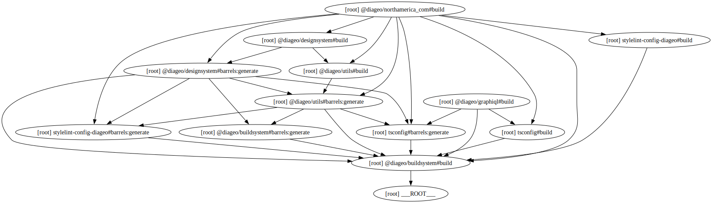

# Diageo Turborepo

# 🤔 Why are we doing this?

Diageo currently have a number of website that shares the same platform. However, the codebase we have does not cater to the needs of the business. We have a number of issues that we need to address:

- All sites shared the same code but we had no way of knowing which version of the code was deployed to each site.
- The codebase was stored in different diverging branches so what worked on one site didnt neccessarily work on another.
- The repository itself included everything needed for deployment, such as api keys etc. This was unsafe
- We had no structured way of versioning code and let sites, packages etc use different versions

# 🤩 How we're solving this

## Turborepo

https://turbo.build/repo

Turborepo is the goto monorepo when working with, for example, Next. Thanks to this we can seperate our codebase into apps, packages and websites. Everyone of these has their own package.json with unique versioning, dependencies etc. Turborepo also give us advantages such as cached builds etc.

## PNPM

https://pnpm.io/

One foundation for Turborepo is workspaces. PNPM has this and a very efficient way of handling packages. We like fast.

## Changesets

https://github.com/changesets/changesets

With changesets we can be very granular in how and when we do releases. Changesets also creates changelogs for each packages and helps us to deploy NPM packages to our private NPM registry.

## Azure Devops NPM registry

https://dev.azure.com/comprend/Diageo%20Platform/_artifacts/feed/Diageo

Everytime we release a package gets stored on Azure. These packages can then be consumed as a normal npm package or used as a container for what should be deployed.-backdrop-hue-rotate-15

## Sharable configs

The whole monorepo now shares the same config for things such as linting, formatting etc. This makes it easier to maintain and align our codebase.

---

# 🛠️ Installation

## 1. Install PNPM globally - https://pnpm.io/installation

## 2. Configure your `.npmrc` files

Since we're using a private registry you need to authenticate yourself towards Azure. Follow this guide:
https://learn.microsoft.com/en-us/azure/devops/artifacts/npm/npmrc?view=azure-devops&tabs=windows%2Cclassic

⚠️ **Please note that the process is different for mac and pc**

## 3. Clone the repo

Just do as normal 😂

## 4. Install dependencies

Run `pnpm install` and you're good to go. Remember, `yarn` and `npm` is not allowed.

# 👩‍💻 Developing

Nothing new under the sun here, just run `pnpm run dev`. Run it on rootlevel to start every project or go into individual folders and run it there.

# Git strategy

- Commits directly to `main` are not allowed, we work with Pull Requests(see below).
- Every commit should follow the [Conventional Commits](https://www.conventionalcommits.org/en/v1.0.0/) standard.
- Thanks to Conventional Commits, we can automate our changelog generation using [semantic-release](https://github.com/semantic-release/semantic-release). See [CHANGELOG.md](CHANGELOG.md) for commit history to the workspace. Please note that each workspace also has a changelog generated by our changesets.

## Branches
- `main` is the releaseable branch, it should always be deployable.
- Every ticket in JIRA should have a corresponding branch, named after the ticket key. For example, if the ticket key is `DIAG-123`, the branch should be named `feat/DIAG-123`. If its not a `feat` we can use `fix`, `chore`, `docs`, etc.

## Pull Requests
- Each PR should be small. If you are working on a big feature, break it down into smaller PRs.
- The only way to push to main is to create a Pull Request from a branch 
- Our pipeline will only accept a PR that has a active ***changeset (see below)*** 🚨
- The Pull Request should be reviewed by teammembers

### Reviewing Pull Requests
**This is important!** 

To ensure that we are following the same standards and get familiar with the codebase we review all PRs. Remember; The comment feature is your friend.

### Azure Devops settings
Make sure to squash commits, delete your branch and customize the commit message so it adheres to conventional commits.

# 🚀 Releasing new versions

Everytime we commit to `main` we version and publish our changesets. The incoming PR must contain at least 1 changeset explaing what has been produced for the different packages. 

## 🦋 Creating changesets

`pnpm run changesets:create`

This will start a guide for you when you select what packages to release and if its a major, minor or patch update. If you're doing several releases you can do `pnpm run changesets:create` several times. Everytime you create a changeset you're creating something similar to a database migration that will then be handled by the pipeline itself

## How to release and publish?
⚠️ This is done in the pipelines for you so no manual work required!

## Changesets gotchas

- Changesets are not dependent on git commits. Commit all you want and then do a release when you're ready. However, we still use conventional commits so its not total anarchy.
- Not every change needs a release. We do plenty of stuff that shouldn't be released per se.

# Build graph

